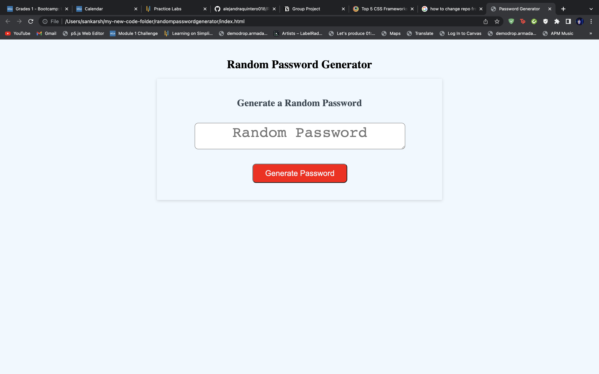

# New-Sounds-in-Town

## Description

Provide a short description explaining the what, why, and how of your project. Use the following questions as a guide:

- What was your motivation?
    I wanted to write a code to design a password geenerator that spits out random characters as password from prompts given by the user
- Why did you build this project?
    It was a chance for me to learn how real world applications work with respect to password geenration
- What problem does it solve?
    It helps in storing a password and generating a complkcating one each time you want a new one. Complicated passwords usually pave way for high security for applications.
- What did you learn?
     I learned how to implements basics of JavaScripts into a new file. I learned about the console.log and how useful it can be in troubeshooting my javascript. I also learned about storing data in an empty array, to later be able to display it.


## Usage

When the user clicks the button, "Generate Password", then the user is given a series of prompts each of which will ask the user of a different criteria regarding the random password. The user will also be asked how long the password should be, then be given a random password with the criteria that they chose. 

The link to the above page is https://sankyrajeev.github.io/randompasswordgenerator/

    
   md
    ```
    

